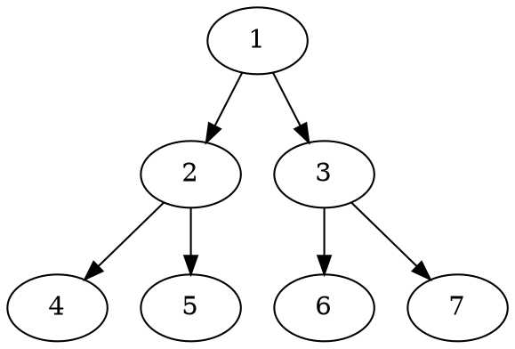

[CSS揭秘](https://cread.jd.com/read/startRead.action?bookId=30410281&readType=1)

[CSS揭秘读书笔记-You-need-to-know-css](https://lhammer.cn/You-need-to-know-css/#/zh-cn/introduce?v=1)


<pre>`This will be displayed as-is`</pre>

:::v-pre
`{{This will be displayed as-is}}`
:::


```plantuml
Bob -> Alice : hello
```



```ditaa
+--------+   +-------+    +-------+
|        +---+ ditaa +--> |       |
|  Text  |   +-------+    |diagram|
|Document|   |!magic!|    |       |
|     {d}|   |       |    |       |
+---+----+   +-------+    +-------+
  :                         ^
  |       Lots of work      |
  +-------------------------+
```
<CodePen title="Create animation with a class" slug="XWRoZob" tab="result" :editable="true" :preview="false" :height="400" />

