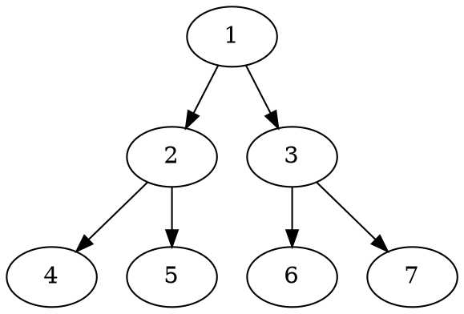

## markdown-it

[markdown书写语法案例](https://markdown-it.github.io/)

[markdown-emoji大全](https://github.com/markdown-it/markdown-it-emoji/blob/master/lib/data/full.json)

[github-emoji大全](https://www.webfx.com/tools/emoji-cheat-sheet/)

[emoji大全](https://emoji.muan.co/#)

[强大的电子书资源网站](https://sobooks.cc/)

[Node.js 最佳实践](https://github.com/goldbergyoni/nodebestpractices/blob/master/README.chinese.md)

[正则大全](https://any86.github.io/any-rule/)

[你用前端知识认识各种算法](https://github.com/trekhleb/javascript-algorithms/blob/master/README.zh-CN.md)

[个人博客-工具集合](https://www.kwgg2020.com/study.html)

[PlantUML](https://plantuml.com/zh/nwdiag)

[DOT](https://graphviz.gitlab.io/docs/outputs/)


<pre>`This will be displayed as-is`</pre>

:::v-pre
`{{This will be displayed as-is}}`
:::


```plantuml
Bob -> Alice : hello
```



```ditaa
+--------+   +-------+    +-------+
|        +---+ ditaa +--> |       |
|  Text  |   +-------+    |diagram|
|Document|   |!magic!|    |       |
|     {d}|   |       |    |       |
+---+----+   +-------+    +-------+
  :                         ^
  |       Lots of work      |
  +-------------------------+
```
