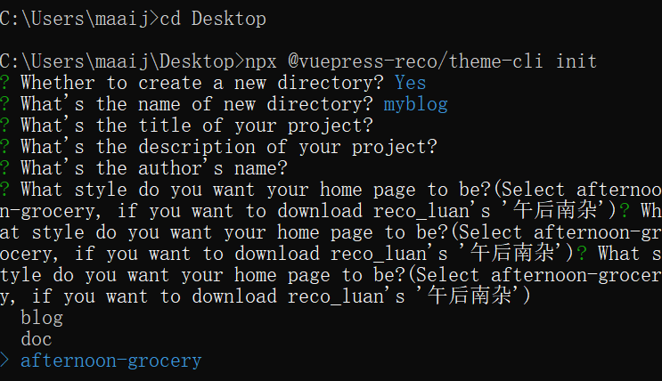

:::tip
0.9系列——无脑搭建篇
:::

<!-- more -->

## 创建本地项目

### Method 1

打开 [vuepress-theme-reco官方文档](https://vuepress-reco-doc.vercel.app/)，导航到”快速开始“，自己查看文档。。。

当然，觉得麻烦不想看文档的童鞋，可以直接运行：

```bash
  npx @vuepress-reco/theme-cli init
```



回车! Wait a minute...

下载好之后改改名字配置就可以啦 :smile:

### Method 2

从github上把[我的项目](https://github.com/QiYoe/c-blog)clone下来，改一改名字啥的 :rofl:

## 把本地项目推送到github

这个如果不懂的话可以[百度](https://www.cnblogs.com/sdcs/p/8270029.html)

## 自动化部署

### travis

目前不讲这个，但我的项目里已配置。如有需求。可自行[百度](https://www.baidu.com/)

### git actions

请首先看这篇[说明](https://zhuanlan.zhihu.com/p/93829286)。其中有几点注意事项：

#### yaml文件配置之创建yaml文件

在github项目tab栏点击actions，选择第一个模板。创建的模板yaml文件名字可以随意命名，比如main.yaml、cli.yaml等等（文件内容配置可看我的[workflows配置](https://github.com/QiYoe/c-blog/blob/main/.github/workflows/main.yml)）

#### yaml文件配置之配置yaml文件

```yaml
on:
  push:
    branches:
      - main  # 这是项目主分支的名称，如果项目主分支名为master，此处就改为master
  workflow_dispatch:  # 这个选项为手动触发actions，主要用于第一次第一次push没成功，然后手动触发actions事件

...

jobs:
  build-and-deploy:
    strps:
      - name: Deploy
      with:
        ACCESS_TOKEN: ${{ secrets.ACCESS_TOKEN }}  
        #此处有两点注意：
        #1、如果此处改为secrets.GITHUB_TOKEN，则无需额外配置ACCESS_TOKEN，但此种方法不安全而且无法兼容travis
        #2、如果此处设为secrets.ACCESS_TOKEN，则需要配置ACCESS_TOKEN
```

#### yaml文件配置创建secrets.ACCESS_TOKEN

##### 创建personal access token（个人访问令牌）

[官网配置文档](https://docs.github.com/cn/github/authenticating-to-github/creating-a-personal-access-token)

:::warning
**创建token选择scopes一定选上`repo`和`workflow`，其他的自己看情况选择；最后获取到的token记得先`保存`下来**
:::

##### 创建secrets.ACCESS_TOKEN

[教程](https://zhuanlan.zhihu.com/p/93829286)

:::warning
**name为`ACCESS_TOKEN`；value为刚才复制的值**
:::

#### 创建git pages

##### 创建站点仓库

[官方文档](https://docs.github.com/cn/pages/getting-started-with-github-pages/creating-a-github-pages-site)

##### 创建项目gh-pages分支

在github的项目上创建`gh_pages`分支。如不会，请自行[百度](https://blog.csdn.net/qq_30607843/article/details/84404000)

##### 设置项目pages

[官方文档](https://docs.github.com/cn/pages/getting-started-with-github-pages/securing-your-github-pages-site-with-https)

:::warning
source栏下的Branch选择为`gh-pages`，后面的选项选则`/(root)`，其他的都按官方文档
:::

#### 验证

##### Method1

本地push一次代码，然后看github上的actions的变化

##### Method2

GitHub上随便修改一个文件内容，提交，然后观察github上的actions的变化

## Go for it

> **阳光正好，未来可期**:muscle:
